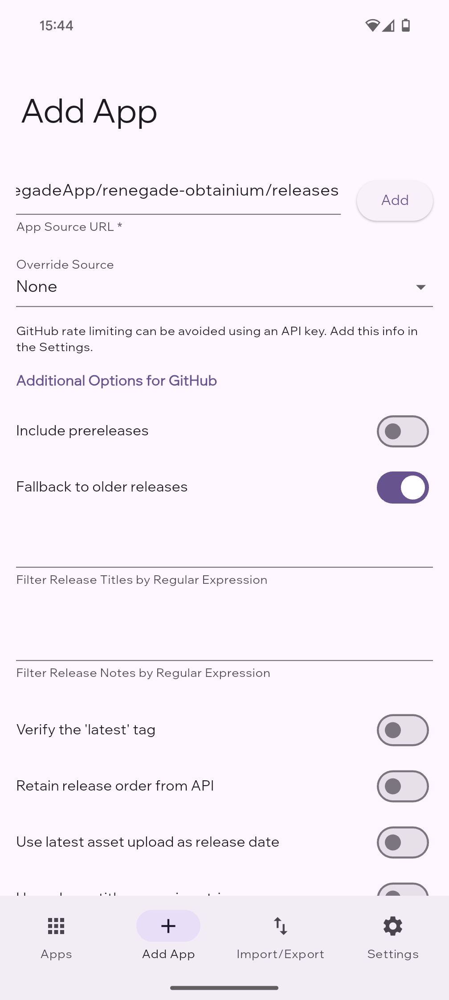
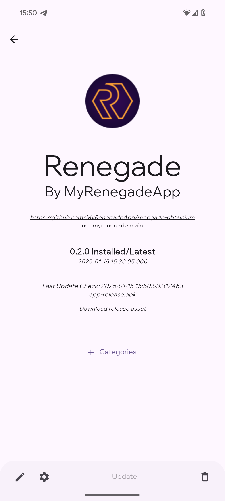

# Renegade App in Obtainium
This repo hosts the releases for the renegade app through Obtainium.
## Install Obtainium

1. Download: Obtain the latest Obtainium APK from the official [Github releases page](https://github.com/ImranR98/Obtainium/releases)
2. Install the app: Install the downloaded APK on your Android device

## Install Renegade through Obtainium

1. Copy Repository URL: Copy this repository URL to download the app through Obtainium: https://github.com/MyRenegadeApp/renegade-obtainium
2. Add in Obtainium: Open Obtainium, go to "Add App", and paste the URL into "App Source URL". Use the default configuration and tap "Add".

